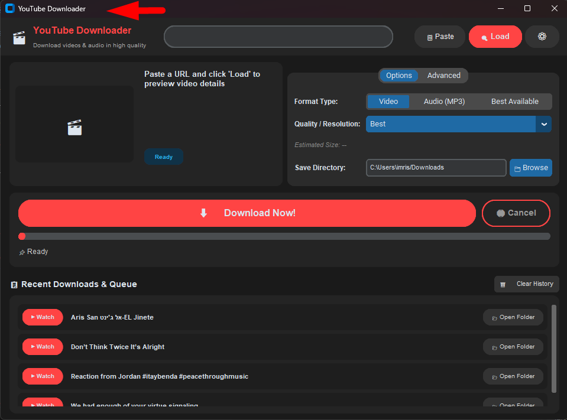

# 🎬 BT YouTube Downloader

<div align="center">


<br/>

**A modern, fast, and feature-rich desktop YouTube video and audio downloader built with Python, CustomTkinter, and `yt-dlp`.**

</div>

---

## 🖼️ Application Preview

<div align="center">
  
</div>

---

## ✨ Features & Highlights

### 🎥 High Quality Video & Audio Downloads
- **Up to 4K / 2160p 60fps**: Download videos at their highest available native quality (4K, 1440p, 1080p, 720p, 480p, 360p).
- **High-Bitrate Audio Extraction**: Extract audio directly to MP3 or M4A with 192k/320k sound fidelity.
- **Smart Stream Muxing**: Automatically merges optimal separate video and audio streams using FFmpeg.

### 🐦 Twitter / X & Social Media Compatibility Mode
- Includes a dedicated post-processor (`TwitterCompatibilityPP`) ensuring downloaded files conform strictly to Twitter/X, Instagram, and web video standards:
  - **Video Codec**: H.264 (AVC) Baseline/High Profile
  - **Pixel Format**: YUV420p (8-bit)
  - **Audio Codec**: AAC / MP3
  - **Faststart Enabled**: Relocates `moov` atom to the beginning of the file for instant streaming playback.

### 🌐 Multi-Language Support (i18n)
- Seamless real-time language switching:
  - 🇺🇸 **English**
  - 🇮🇱 **עברית (Hebrew)** — Full RTL alignment and Hebrew strings
  - 🇮🇳 **हिंदी (Hindi)**
  - 🇹🇭 **ภาษาไทย (Thai)**

### 🎨 Modern Dark & Light Mode UI
- Built with **CustomTkinter** for crisp DPI scaling and macOS/Windows 11 modern aesthetics.
- Quick toggle between **Dark**, **Light**, and **System** themes.
- Animated progress bars, real-time download speeds (MB/s), file size estimation, and ETA timers.

### 📋 Download Queue & History Tracker
- Visual history of downloaded items saved locally in `recent_downloads.json`.
- **▶ Watch**: Direct button to launch the video in your default browser.
- **📂 Open Folder**: One-click jump to the local directory containing the downloaded file.
- Option to clear history anytime.

### ⚙️ Advanced Capabilities
- **Subtitles Download**: Embed or download subtitles in English, Hebrew, Spanish, French, German, and more.
- **Playlist Batch Download**: Detects and downloads complete YouTube playlists automatically.
- **Custom Filename Templates**: Flexible naming rules (e.g., `%(title)s.%(ext)s`, `%(channel)s - %(title)s.%(ext)s`).
- **Auto-Install FFmpeg**: One-click automated download and setup of FFmpeg binaries if not detected on the host system.

---

## 📋 System Requirements

- **Operating System**: Windows 10/11, macOS 11+, or Linux
- **Python**: Python 3.10 or higher
- **FFmpeg**: Required for high-resolution (1080p+) video muxing and audio conversions (can be auto-installed via the app).

---

## 🚀 Installation & Quick Start

### 1. Clone the Repository
```bash
git clone https://github.com/sagive/bt-youtube-downloader.git
cd bt-youtube-downloader
```

### 2. Create and Activate a Virtual Environment
```bash
# Windows (PowerShell / CMD)
python -m venv .venv
.venv\Scripts\activate

# Linux / macOS
python3 -m venv .venv
source .venv/bin/activate
```

### 3. Install Dependencies
```bash
pip install -r requirements.txt
```

### 4. Run the Application
```bash
python youtube_downloader.py
```

---

## 🛠️ Building a Standalone Executable (.exe)

You can package the entire application into a standalone executable using the included PyInstaller specification file:

```bash
# Install PyInstaller
pip install pyinstaller

# Build the executable
pyinstaller "YouTube Downloader.spec"
```

The compiled standalone executable will be located in the `dist/` directory.

---

## 📁 Project Structure

```
bt-youtube-downloader/
├── assets/
│   └── screenshot.png          # App preview screenshot
├── requirements.txt            # Python package dependencies
├── youtube_downloader.py       # Main application & GUI source code
├── YouTube Downloader.spec     # PyInstaller build specification
├── .gitignore                  # Git ignore definitions
└── README.md                   # Project documentation
```

---

## 🧩 Dependencies & Libraries

- [`yt-dlp`](https://github.com/yt-dlp/yt-dlp) — Powerful YouTube & streaming extraction engine.
- [`customtkinter`](https://github.com/TomSchimansky/CustomTkinter) — Modern UI extension library for Tkinter.
- [`Pillow`](https://python-pillow.org/) — Image loading and thumbnail rendering.

---

## 📄 License

This project is licensed under the MIT License - see the LICENSE file for details.
